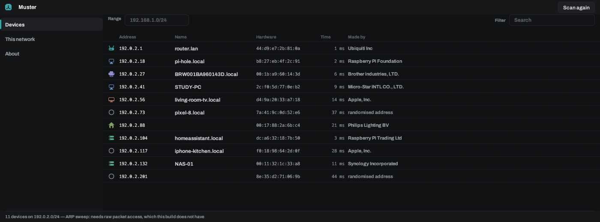
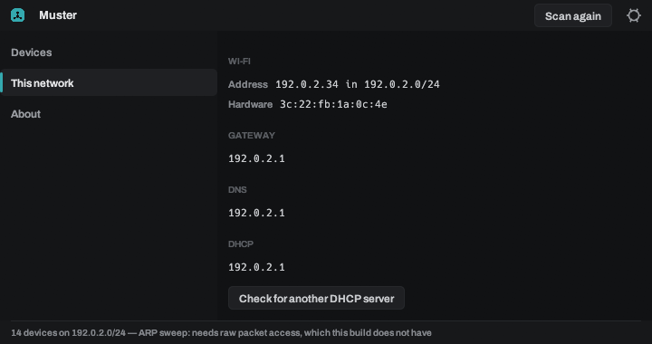

<p align="center">
  <picture>
    <source media="(prefers-color-scheme: light)" srcset="docs/images/banner-paper.png">
    
  </picture>
</p>

<p align="center">
  A network scanner built for one thing above all others: <b>the network you
  are actually on</b>. What is here, what it is, and what it is offering.
</p>

<p align="center">
  Runs as an ordinary user · names devices from mDNS, NetBIOS and reverse DNS ·
  vendors from the IEEE registry, compiled in · nothing about your network
  leaves the machine
</p>


> **Early days.** The survey, the sweep, naming and the port scan all work, on
> Windows and Linux, without administrator rights. The fast SYN scan is not
> built yet, and the port scan opens a connection per port until it is.
> [What is not there yet](#what-is-not-there-yet) is honest about the rest.

## Install

**Muster 0.0.3.** Take the file for your system, or browse the
[release itself](https://github.com/Spillebulle/muster/releases/latest) for the
notes and the checksums.

| Your system | x86-64 | ARM64 |
|---|---|---|
| Windows | [Installer](https://github.com/Spillebulle/muster/releases/download/v0.0.3/muster-setup-0.0.3-x64.exe) | [Installer](https://github.com/Spillebulle/muster/releases/download/v0.0.3/muster-setup-0.0.3-arm64.exe) |
| Debian, Ubuntu, Mint | [`.deb`](https://github.com/Spillebulle/muster/releases/download/v0.0.3/muster_0.0.3_amd64.deb) | [`.deb`](https://github.com/Spillebulle/muster/releases/download/v0.0.3/muster_0.0.3_arm64.deb) |
| Fedora, RHEL, openSUSE | [`.rpm`](https://github.com/Spillebulle/muster/releases/download/v0.0.3/muster-0.0.3-1.x86_64.rpm) | [`.rpm`](https://github.com/Spillebulle/muster/releases/download/v0.0.3/muster-0.0.3-1.aarch64.rpm) |
| Arch | [`.pkg.tar.zst`](https://github.com/Spillebulle/muster/releases/download/v0.0.3/muster-bin-0.0.3-1-x86_64.pkg.tar.zst) | not built |
| Any other Linux | [AppImage](https://github.com/Spillebulle/muster/releases/download/v0.0.3/Muster-0.0.3-x86_64.AppImage), one file with nothing to install | [AppImage](https://github.com/Spillebulle/muster/releases/download/v0.0.3/Muster-0.0.3-aarch64.AppImage) |
| Flatpak | [`.flatpak` bundle](https://github.com/Spillebulle/muster/releases/download/v0.0.3/muster-0.0.3-x86_64.flatpak) | not built |
| Windows, `.msi` to deploy | [`.msi`](https://github.com/Spillebulle/muster/releases/download/v0.0.3/muster-0.0.3-x64.msi) | [`.msi`](https://github.com/Spillebulle/muster/releases/download/v0.0.3/muster-0.0.3-arm64.msi) |
| Windows, no installer | [`.zip`](https://github.com/Spillebulle/muster/releases/download/v0.0.3/muster-0.0.3-x86_64-pc-windows-msvc.zip) | [`.zip`](https://github.com/Spillebulle/muster/releases/download/v0.0.3/muster-0.0.3-aarch64-pc-windows-msvc.zip) |
| Linux, no package | [`.tar.gz`](https://github.com/Spillebulle/muster/releases/download/v0.0.3/muster-0.0.3-x86_64-unknown-linux-gnu.tar.gz) | [`.tar.gz`](https://github.com/Spillebulle/muster/releases/download/v0.0.3/muster-0.0.3-aarch64-unknown-linux-gnu.tar.gz) |

There is nothing to configure and nothing to elevate. Muster scans as whatever
user you started it as, and the window needs a GPU with Vulkan or Direct3D 12,
which is any machine from the last decade. The Linux packages pull in the
libraries the window opens at runtime; the text mode needs none of them and
runs happily over SSH.

Muster can check for new versions when it starts. It asks you before the first
check, and you can change the answer in **About**. That request is the only one
Muster ever makes on its own behalf.

## The device list



This is the application. Every device the sweep found, with the name it gave for
itself, how long it took to answer, and who made its network hardware. Figures
are monospaced and the columns line up, because the point of a table of
addresses is reading down it.

The vendor comes from the IEEE registry compiled into the binary, so it works
with no internet connection and no lookup service. **A randomised hardware
address is reported as randomised**, not as an unknown vendor. Every modern
phone sets one per network, and calling that "unknown" makes the list look
broken to the people who know most.

## What counts as found

A device that **refuses** a connection has proved it is there just as surely as
one that accepts it. Muster counts both, which is how it sees the many machines
that ignore ping and answer a knock with a refusal.

Silence is the opposite: it proves nothing at all. An address that never
answered is not reported as empty, and a port that never answered is reported as
filtered rather than closed. That distinction is the most common lie a scanner
tells, and the status bar names anything the sweep could not do rather than
presenting a short list as the whole answer.

## This network



Everything the machine already knows, read straight from the operating system
with no packets sent and no privileges needed. Your address and prefix, the
gateway, the resolvers you are actually using and the server that gave you the
lease.

It answers "what is my gateway, what is my DNS" the moment the window opens, so
it is useful on its own rather than as a preamble to a scan.

## The text mode

The same engine, in the same binary, printing aligned tables. No display server
required, so it works over SSH.

| Command | What it does |
|---|---|
| `muster` | Opens the window |
| `muster survey` | What this machine knows. No packets sent |
| `muster scan` | Sweeps the network this machine is on |
| `muster scan 10.0.0.0/24` | Sweeps a prefix you name |
| `muster ports 192.0.2.18` | The ports worth knowing about, on one host |
| `muster ports 192.0.2.18 1-1024` | A range you name |

## Conduct

Muster is a tool for a network you are on, and the defaults keep it that way.
The default target is the prefix this machine sits in, never a range somebody
typed and never anything beyond the link. Scanning something else is a
deliberate act you have to ask for.

Muster identifies services. It does not authenticate to them, does not try
credentials, and carries nothing intended to make anything crash. Reading a
banner and asking a device its name is the whole of the interaction.

How the scan is put together, and why an unanswered probe is never reported as
a closed port, is in [`docs/architecture.md`](docs/architecture.md).

## What is not there yet

- **The fast port scan.** The stateless SYN scan needs raw packet access, which
  means Npcap on Windows and `CAP_NET_RAW` on Linux. Until it lands the port
  scan opens one connection per port: correct, unprivileged, and slower by a
  large factor. The result says which one produced it.
- **The privileged engine generally.** No ARP sweep, no DHCP discovery from
  port 68, no passive fingerprinting, no LLDP or CDP. The Linux packages
  therefore do not `setcap` the binary yet: there is nothing to grant it for.
- **IPv6 sweeping.** Addresses, routes and gateways are read and shown for both
  families, but a sweep walks IPv4 addresses. An IPv6 prefix is not swept
  address by address, and the scan says so instead of reporting nothing found.
- **SSDP and UPnP, TLS certificates, UDP service probes.** mDNS, NetBIOS and
  reverse DNS answer today; the rest of identification does not.
- **Saved scans and monitoring.** Nothing is written to disk, so two scans of
  the same network a week apart cannot yet be compared.
- **macOS.** Not a target, and not planned.

## Building from source

```sh
git clone https://github.com/Spillebulle/muster
cd muster
cargo run --release          # the window
cargo test                   # everything; no test touches a network
```

## Licence

GPL-3.0-or-later; see [LICENSE](LICENSE). The interface is set in
[Archivo](https://github.com/Omnibus-Type/Archivo) under the SIL Open Font
License. Hardware vendor names come from the IEEE MA-L, MA-M and MA-S registry.
